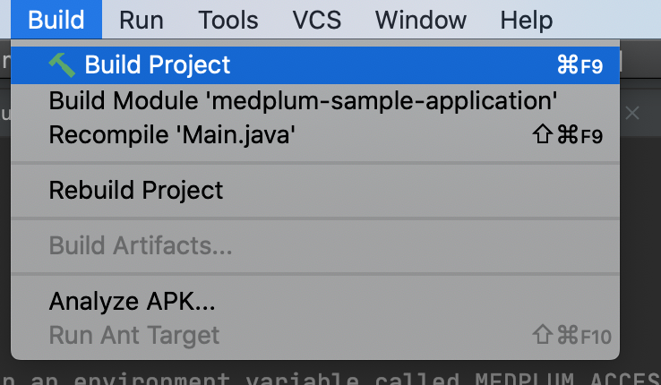
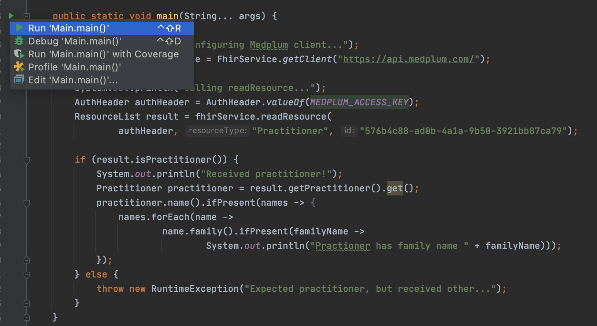

# Medplum Clients

Checkout the generated FHIR Java client by running the following commands.

#### Step 1: Clone the repo

```
git clone git@github.com:fern-api/medplum-clients.git
```

#### Step 2: Change directory

```
cd medplum-clients
```

#### Step 3: Run fern. This will codegen the clients.

```
./fern.sh
```

#### Step 4: Open in Intellij

```
cd medplum-java
./gradlew idea && open *.ipr
```

#### Step 5: Build the Intellij Project



#### Step 6: Open [Main.java](./medplum-java/medplum-sample-application/src/main/java/com/sample/Main.java) located in `medplum-sample-application`

#### Step 7: Add Medplum Access Key to your environment in Intellij

#### Step 8: Use the SDK!


