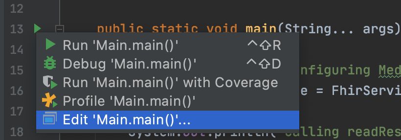
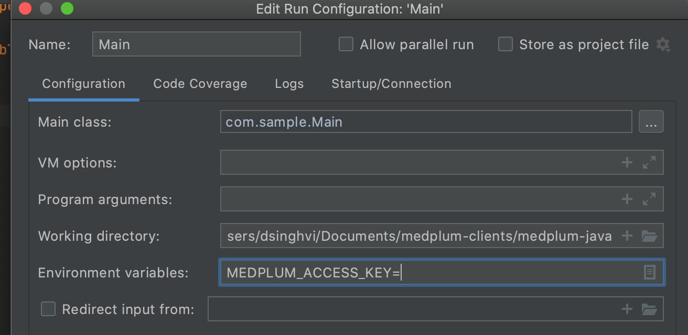

# Java Client

The [medplum-java-client](./medplum-java-client/) subproject was generated by Fern.

Run `./gradlew idea && open *.ipr` to open in Intellij.

The generated source code lives inside [here](./medplum-java-client/src/generated/java/com/medplum/). The generated source code uses [java immutables](https://immutables.github.io/) so it is necessary to build in Intellij so that the immutables annotation processor can run. **This can take a minute - because of how extensive FHIR is, this is generating a million lines of code!**

Make sure to add your access key as an environment variable ```MEDPLUM_ACCESS_KEY```. You can do this by navigating to [sample app](./medplum-java/medplum-sample-application/src/main/java/com/sample/Main.java). 

Find the play button and edit configuration


Update the environment variables section 


## Important Files

[FhirService.java](./medplum-java-client/src/generated/java/com/medplum/services/fhir/FhirService.java) is the generated REST service that has endpoints like `readResource`, `updateResource`, etc.

[ResourceList.java](./medplum-java-client/src/generated/java/com/medplum/types/fhir/ResourceList.java) is a union type. Union types can be visited by calling the `accept` method and passing in a visitor so that a client can be sure they handle all possible states.

[SampleApplication Main.java](./medplum-sample-application//src/main/java/com/sample/Main.java) is an example of how to consume the java client.
